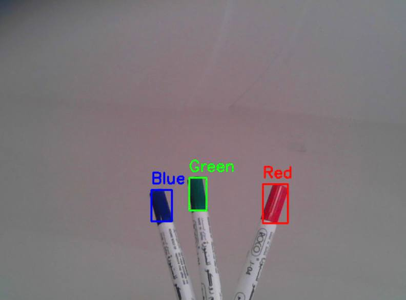

# OpenCV Color Recognition

## Project Overview

This project is a Computer Vision application developed using Python and OpenCV. It performs real-time color recognition through a webcam by processing live video frames, detecting predefined colors using the HSV color space, and displaying the detected color name on the screen.

---

## Features

- Real-time color recognition
- Live webcam processing
- HSV color space detection
- Detects predefined colors
- Draws a bounding box around the detected object
- Displays the detected color name
- Fast and simple implementation
- Built with Python and OpenCV

---

## Technologies Used

- Python
- OpenCV
- NumPy
- Anaconda

---

## How It Works

The program performs the following steps:

1. Opens the webcam.
2. Captures video frames continuously.
3. Converts each frame from BGR to HSV color space.
4. Applies predefined HSV ranges to detect colors.
5. Detects the colored object.
6. Draws a bounding box around the detected object.
7. Displays the detected color name in real time.

---

## How to Run

1. Open the project in Visual Studio Code.
2. Activate the Anaconda environment.
3. Install the required libraries if needed.
4. Run color_recognition.py.
5. Show colored objects to the webcam.
6. Press Q to exit.

---

## Project Demo

